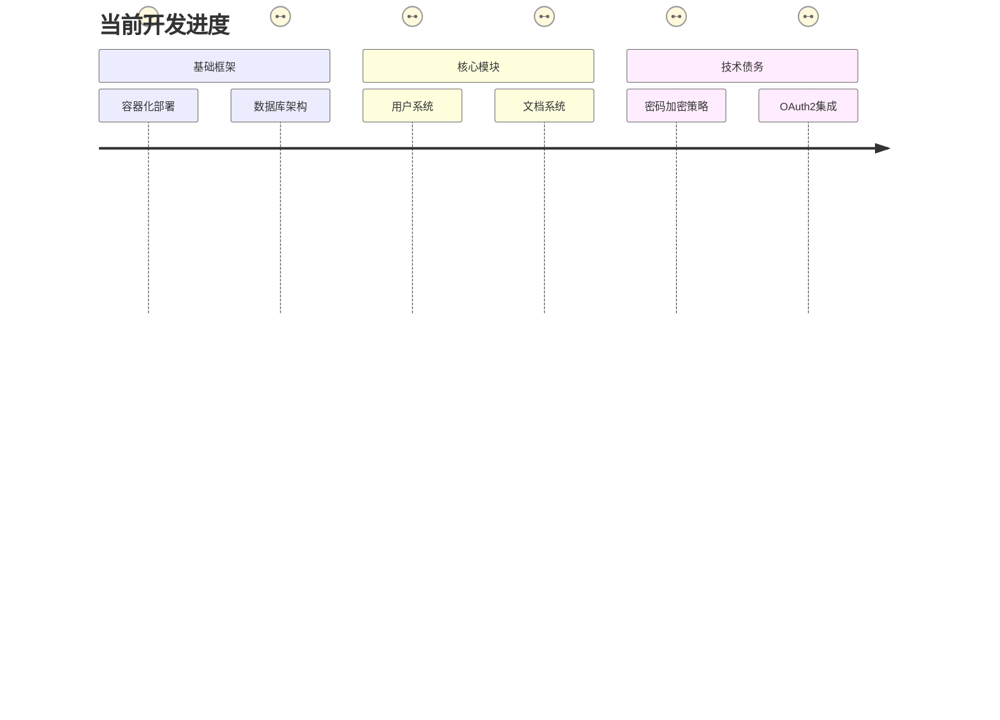
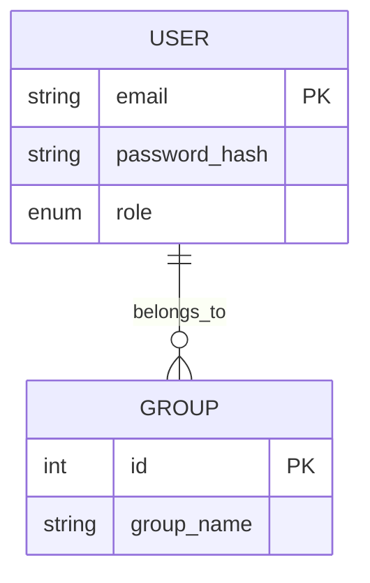
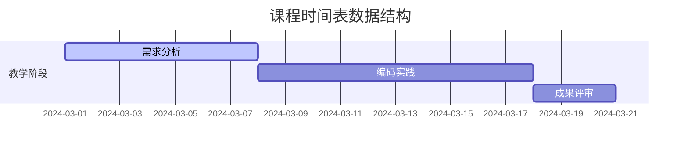

```markdown
# CodeCollab 项目开发Prompt

## 项目背景
**项目类型**: 教育领域协作编程平台（毕业设计）  
**开发模式**: 单人全栈开发  
**核心价值**: 实现教学全流程数字化管理，重点解决代码协作与教学资源整合痛点  

## 当前状态


## 技术栈锁定
```yaml
backend_stack:
  - Django 5.1.7 (已部署)
  - PostgreSQL 15 (已配置卷映射)
  - Redis 7.2 (计划缓存会话)
frontend_stack:
  - React 18 (待集成)
  - Ant Design 5.0 (UI框架候选)
devops:
  - Docker Compose v2.23
  - Nginx 1.25 (反向代理配置待完成)
  - Github Actions (CI/CD待配置)
```

## 功能需求分解
### 1. 用户系统 (P0)


### 2. 课程管理 (P1)
- 课程生命周期状态机：
``` 
[草稿] → [进行中] → [已结课]  
           ↳ [暂停]
```

### 3. 代码管理 (P0)
```python
# 伪代码示例
class CodeSpace(models.Model):
    version_control = models.JSONField()  # 存储git-like元数据
    contribution = models.JSONField()     # 成员贡献度记录
    export_history = models.ManyToManyField(ExportRecord)
    
    def calculate_contribution(self):
        # 基于代码行数/提交频率的算法
```

### 4. 教学管理 (P1)


## 开发优先级矩阵
| 模块 | 紧急度 | 技术复杂度 | 依赖项 |
|-------|--------|------------|--------|
| 用户认证 | ⭐️⭐️⭐️⭐️ | 中 | 无 |
| RBAC权限 | ⭐️⭐️⭐️ | 高 | 用户系统 |
| 代码版本控制 | ⭐️⭐️⭐️⭐️ | 高 | 文件存储方案 |
| 实验报告导出 | ⭐️⭐️ | 低 | 文档管理模块 |

## 风险雷达
```risk-matrix
               High| [密码安全]  
                   | [贡献度算法]  
Moderate           |           [文件并发冲突]
                   |           [容器资源限制]
               Low |                      [UI一致性]
                   |                      [导出格式兼容]
                   -------------------------------
                     Low                   High
                      实现风险          设计风险
```

**下一步行动建议**：
1. 优先完成用户系统的RBAC模型设计
2. 确定代码贡献度计算算法
3. 选择文件存储方案（本地/MinIO）
4. 建立自动化测试框架

请基于此Prompt解决提出的具体技术问题或决策需求，提供针对性解决方案（附代码示例/架构图/性能对比）,代码使用Django官方推荐的符合开发哲学的样式。
```