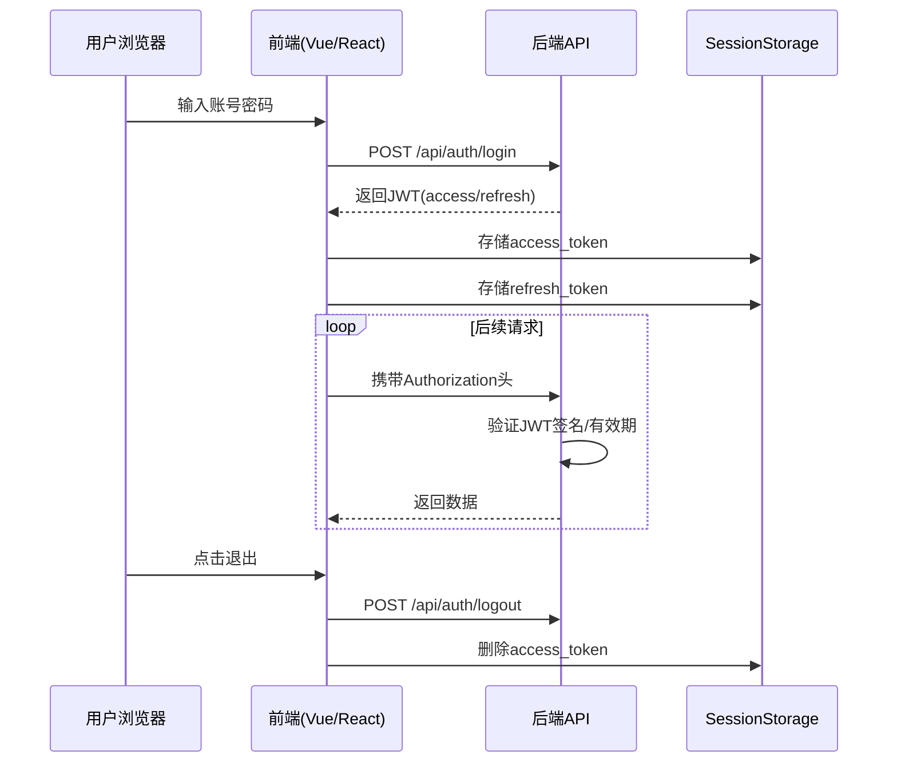

---
tags:
  - Log
created: 2025-03-24 21:45
modified: 2025-03-24 21:45
---

## 2025-03-24 开发日志

### 🎯 今日目标
- [x] 实现前后端分离(vue.js框架)
- [x] JWT令牌生成

### 📝 完成情况
- 实现前后端分离
  - 代码位置：`app/views.py#L23-45`
  - 相关文档：
- JWT令牌生成
  - 代码位置：`backend/accounts/serializer.py`，`backend/accounts/api/views.py`
  - JWT存储框架

### ❗ 遇到的问题
- **问题描述**：JWT返回的令牌没有token
- **解决方案**：自定义序列化器需要继承`TokenObtainPairSerializer`
- **关联记录**：[[Django JWT序列化生成器解析]]

### 🌱 明日计划
- [ ] 完成不同用户角色登录显示不同的前端界面
- [ ] 环境变量导入API基地址
- [ ] 实现用户携带令牌访问数据
- [ ] 日志系统

