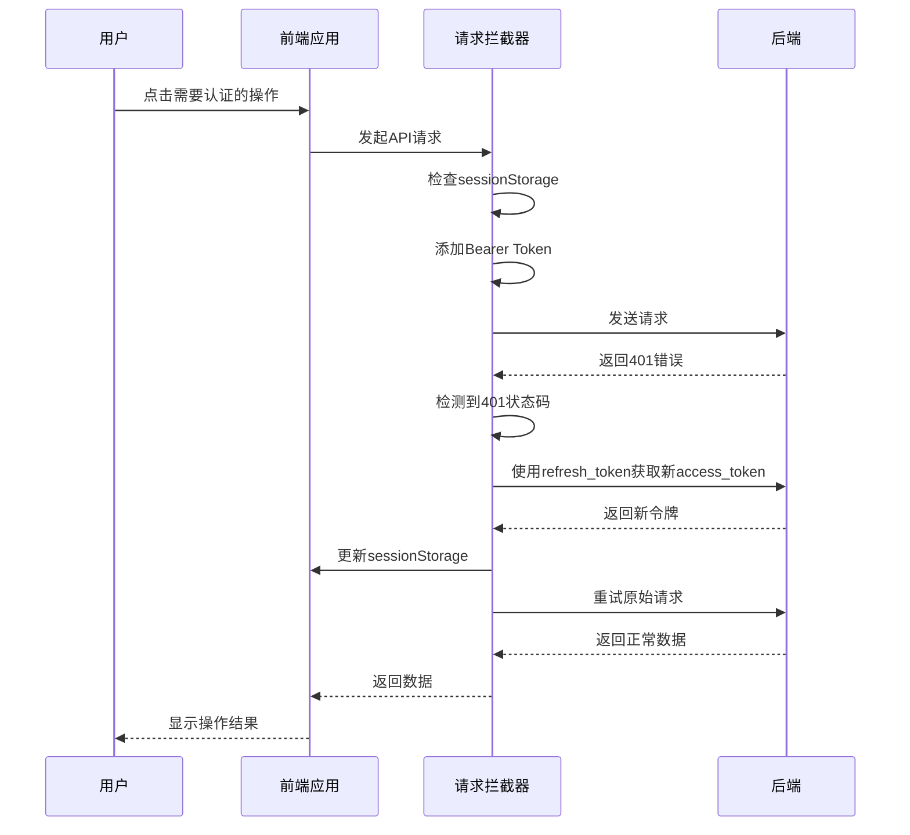

---
tags:
  - Log
created: 2025-03-25 16:18
modified: 2025-03-25 16:18
---

## 2025-03-25 开发日志

### 🎯 今日目标
- [x] JWT token无感化处理
- [x] 请求API基地址环境变量化

### 📝 完成情况
- 相关提问: [[前端鉴权存储]]
- JWT token 无感化处理(请求拦截器)
	-  代码位置：`frontend/src/utils/auth.js#`
	- 具体描述：
		- 实现了 网站在请求时自动将access_token加入请求头中
		- 实现了 access_token过期之后自动请求新access_token
		- 存储令牌策略：`sessionStorage`

- API路由规范
	- 统一请求基地址：`http://localhost:8000/api/v1`
	- 存储到环境变量中通过axios拦截器自动添加基地址
- 登录流程优化
	- 描述：新增了记住我功能
		- 勾选后关闭浏览器再打开也不需要登录认证。
		- 反之退出浏览器后下次访问需要登录认证。
- 身份验证模块初步完成
	- 描述
		- 可以根据不同的用户显示不同的页面

### 🌱 明日计划
- [ ] 用户登出函数
- [ ] 创建HomeView，所有用户都可以进去，进行特定操作时需要登录，比如操作时先看是否有access_token，如果有，去后端鉴权，如果没有，跳转到登录页面

### 📌 临时笔记
```python

```

