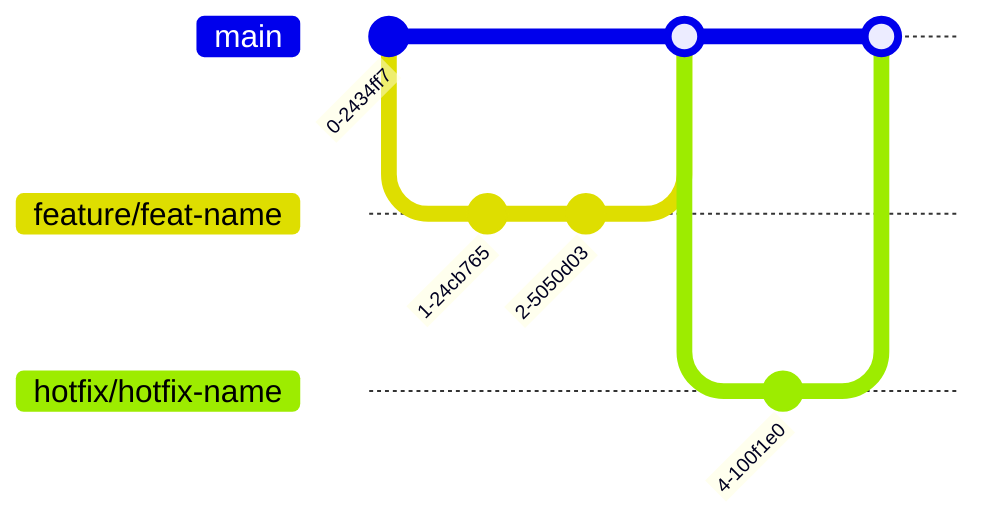

---
tags:
  - Git
---
## 仓库结构规范
![[项目总览#^58ad09|项目结构]]
## 分支策略

### 分支类型说明
| 分支类型     | 命名规范            | 生命周期 | 示例                |
| ------------ | ------------------- | -------- | ------------------- |
| 主分支       | main                | 永久     | 生产可就绪的代码    |
| 功能分支     | feature/\[功能名字] | 短期     | feature/user-models |
| 紧急修复分支 | hotfix/\[问题简述]  | 短期     | hotfix/login-bug                    |
### 提交类型对照表
| 类型     | 适用场景        | 频率 |
| -------- | --------------- | ---- |
| feat     | 新增功能        | 高   |
| fix      | 修复bug         | 高   |
| docs     | 文档变更        | 中   |
| refactor | 代码重构        | 中   |
| test     | 测试相关        | 低   |
| chore    | 构建/依赖等杂项 | 低     |
## 灾难恢复方案
```bash
# 当本地仓库损坏时
git clone https://github.com/name/project.git
git fetch -all
git reset --hard origin/main

# 误删文件恢复
git checkout HEAD -- path/to/file
```
## 每日开发流程
### 1. 开始工作前：
```bash
git pull --rebase
```
### 2. 创建新分支：
```bash
git checkout -b feature/xxx
```
### 3. 阶段性提交：小步多次提交
### 4. 当天结束前：
```bash
git push -u origin feature/xxx
```
### 5. 功能开发完毕后合并到主分支：
```bash
# 切换分支
git checkout main
# 合并分支到当前分支，可选参数: --no-ff, 使用时合并也创建一个commit，使用时需要加上-m
git merge feature/xxx
# 提交到远程
git push origin main
```
### 6. 删除功能分支
```bash
# 确保不在要删除的分支上
git checkout main

# 验证是否已经合并
git branch --merged

# 删除本地分支
git branch -d feature/xxx

# 删除远程分支
git push origin --delete feature/xxx

# 清理本地缓存的远程信息
git fetch origin --prune
```
## 版本回退操作
```bash
# 查看提交历史
git log --oneline

# 重置到指定提交（保留工作区修改）
git reset xxxxxx

# 做出一系列操作

# 重新提交
git add .
git commit -m "xxx:xxxx"

# 强制推送更新（谨慎使用）
git push -f origin main
```